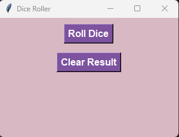
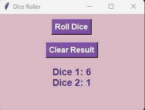
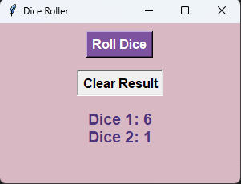

# Dice Roller



## Introduction

This Python script implements a simple Dice Roller application using the tkinter library. The application provides a graphical interface for rolling two dice and displaying the result.

## Features

- Roll two dice simultaneously.
- View the result of each dice roll.
- Clear the result display.

## Installation

To run the Dice Roller application, ensure you have Python installed on your system. Then, follow these steps:

1. Clone the repository:

   ```
   git clone https://github.com/LousyCake/dice-roller-tkinter.git
   ```

2. Run the script:

    ```
    python DiceRoller.py
    ```

## Usage

1. Click the "Roll Dice" button to roll two dice.
2. The result of each dice roll will be displayed on the screen.
3. To clear the result, click the "Clear Result" button.

## Screenshots




## Dependencies

- Python 3.x
- tkinter

## Code Explanation

- The __'DiceRollerApp'__ class initializes the tkinter window and sets up the GUI components.
- Two buttons, "Roll Dice" and "Clear Result", are created to roll the dice and clear the result, respectively.
- The __'roll_dice'__ method generates random values for two dice and updates the result label with the values.
- The __'clear_result'__ method clears the result label.
- The __'main'__ function creates an instance of __'DiceRollerApp'__ and starts the tkinter event loop.

## License
This project is licensed under the MIT License - see the LICENSE file for details.
